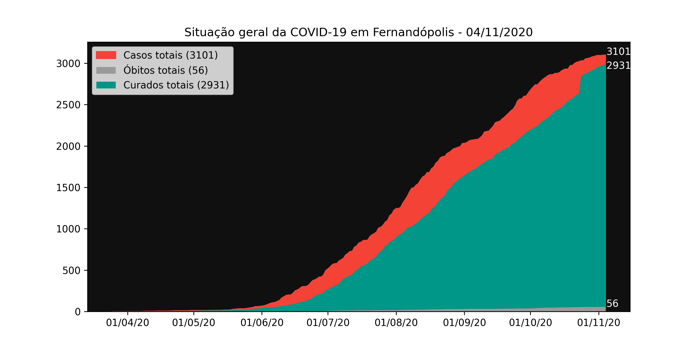
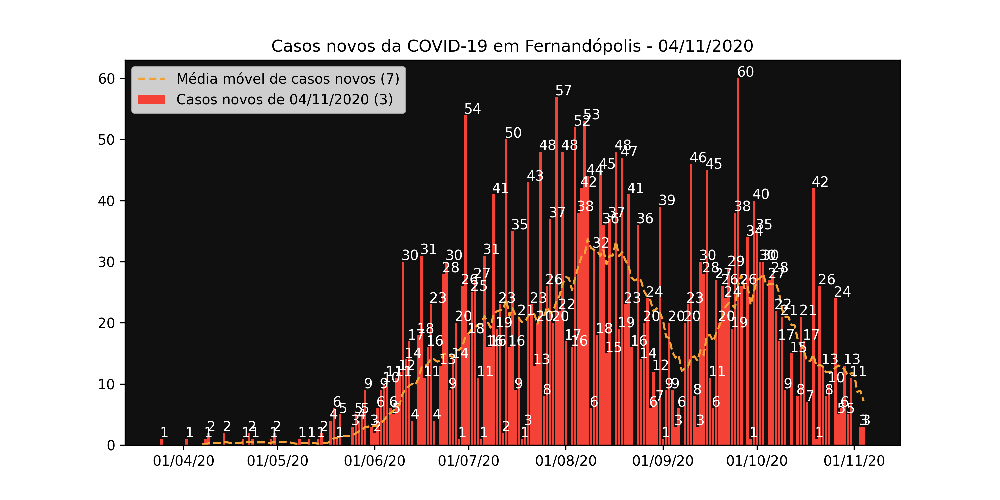
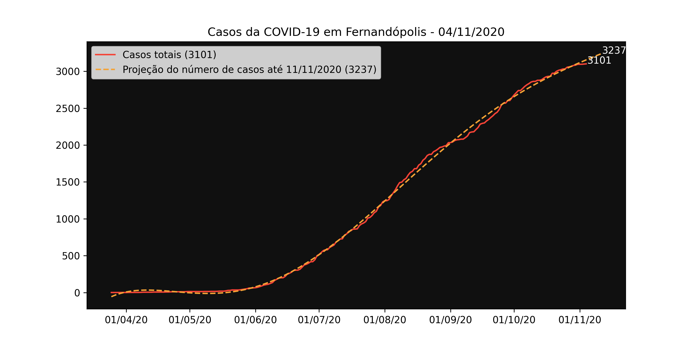

# covid-19-fernandopolis

Repositório público para a divulgação dos casos da COVID-19 de Fernandópolis / SP.

Atualizado de Segunda a Sexta por volta das 19h.

Os dados aqui apresentados são retirados dos boletins epidemiológicos publicados pela prefeitura municipal na sua página do Facebook e por isso apresentam um atraso na sua atualização. Os gráficos gerados pelo script em Python servem apenas de referência, como uma forma de visualização gráfica dos dados já apresentados pela prefeitura. Como já esclarecido na licença, todo o conteúdo desse repositório é de domínio público e pode ser copiado, alterado e republicado livremente.

## Gráficos







## Criação dos gráficos

Para gerar os gráficos com os últimos dados disponíveis no arquivo .csv, execute os comandos abaixo na pasta [chart-generator](./chart-generator).

Utilizando pipenv:

```sh
pipenv install
pipenv run gen
```

Utilizando pip:

```sh
pip install -r requirements.txt
python main.py
```